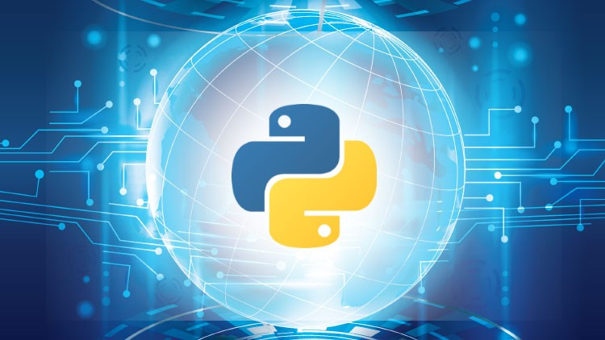

# Python-for-Embedded-and-IoT

This repository is for basic introductory course for 
getting started with Embedded and IoT Development using Python.

## Why Python ?

When it comes to embedded and IoT Development, it has mainly dominated 
by low level programming language mainly [C/C++]() and [Assembly]() due to their
lower memory management capability but its changing now Python is taking a 
leap and become one of top language for IoT and Embedded Development

## Supported Micro-controllers 

- [Raspberry Pi](https://www.raspberrypi.org/) 
- [Pyboard](http://micropython.org/)
- [ESP8266](https://create.arduino.cc/projecthub/Niv_the_anonymous/esp8266-beginner-tutorial-project-6414c8)
- [Arduino](https://www.arduino.cc/) 

## Ways to controlling Arduino with Python ?

- [Micropython](http://micropython.org/)
- [Standard Firmata Protocol](https://pypi.org/project/pyFirmata/)
- [PySerial](https://pythonhosted.org/pyserial/) 

## IoT Development

Here once we learn how to control the micro-controllers with Python

we gonna see how to make everything connected 

#### Requirements 

You can actually use you're favorite web framework to link your 

micro-controllers to cloud but for this tutorial we gonna use [**flask**](https://flask.palletsprojects.com/en/1.1.x/). 

- [Flask](https://flask.palletsprojects.com/en/1.1.x/) or (Django/Fastapi)
- [ngrok](https://flask.palletsprojects.com/en/1.1.x/) (To make a local port accessible over cloud)