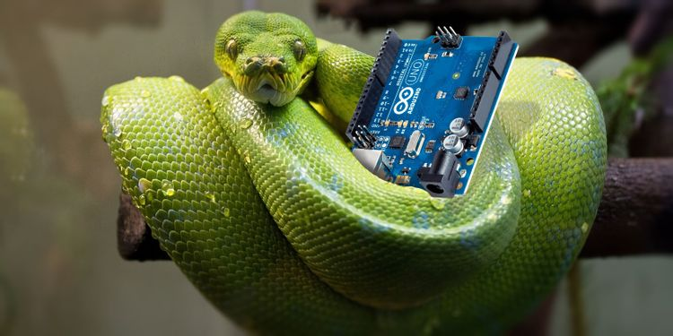
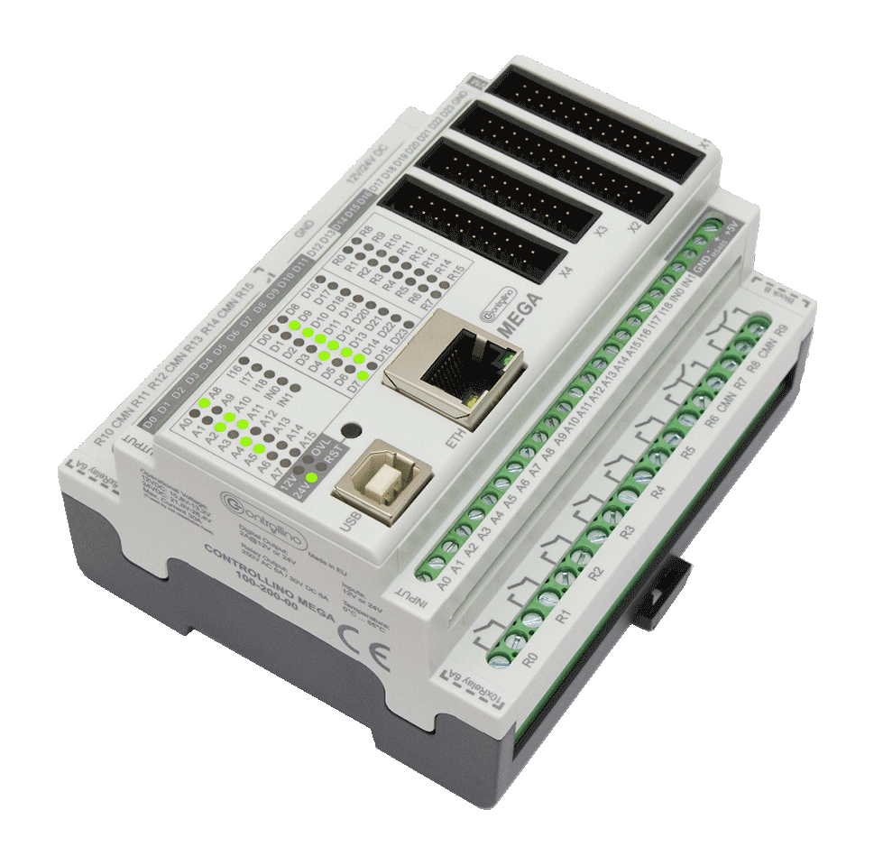

## Basics of Embedded and IoT Development with Python 
We gonna have some brush up on how you can get started 
using Python to build IoT Applications, as we have discussed on the intro session about 
python taking a leap intro Embedded and IoT Dev, let's now dive little deeper to see how
you can get started with it as a Python Beginner.  

## Embedded Dev with Python 

Here we will see how to control Embedded Devices using Python through variety techniques,
There are some few choice of micro-controllers Development that run python natively themselves
such as [Raspberry Pi](https://www.raspberrypi.org/) and [Pyboard](https://store.micropython.org/) with many others choice in which we can control with Python using 
certain protocols, examples of this board includes [Arduino Uno](https://www.arduino.cc/) and [ESP8266](https://www.esp8266.com/).

Due availability In a this Pycon workshop, we are going to focus more on controlling Arduino compatible Arduino boards
We are going to see different approaches that are being used on controlling this micro-controller board Tfrom Python.

If this is your first time hearing about Arduino boards, well its a programmable prototyping board that is heavily used by different kinds of people 
from proffessionals, teachers , students , hobbyst and ... to learn and build micro-controller based electronics projects in easy and simple way.

It has a huge community support with tons of libraries published, and its now being used by different starttup to build their MVP electronics projects
Therefore knowing how deal and control it might open countless of other opportunites.

Apart from the fact arduino is used as Prototyping board, its now being employed to industrial grade to controll industrial process,
with Development of improved board such as [Controllino](https://www.controllino.com/) simplify the whole process when it comes to industrial Automation and Control using builtin arduino board
being programmed by the same arduino IDE.

## Can Arduino run Python ?

Python cannot run or be excuted directly on the arduino-micro-controller from the fact that in order to run python on it,  we need some kind of 
interpreter running in micro-controller which will be memory expensive. some arduino board comes with about **14KiB flash of memory** which can 
be un realist running both an interpreter together with source code in that range of memory .

## How do we control Arduino Python ?

## IOT Dev with Python 

Here we will see how to link our Embedded Devices 

to Cloud with Python 

## Demo IoT Project 

In this part we are going to build a simple Demo IoT Project 

using Python 