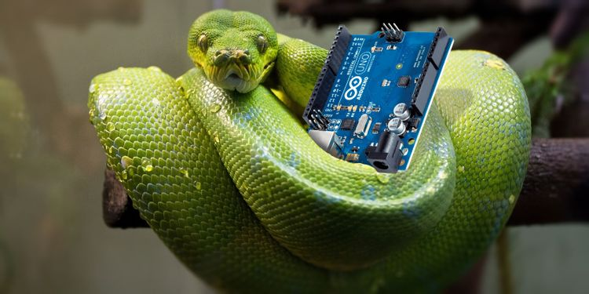
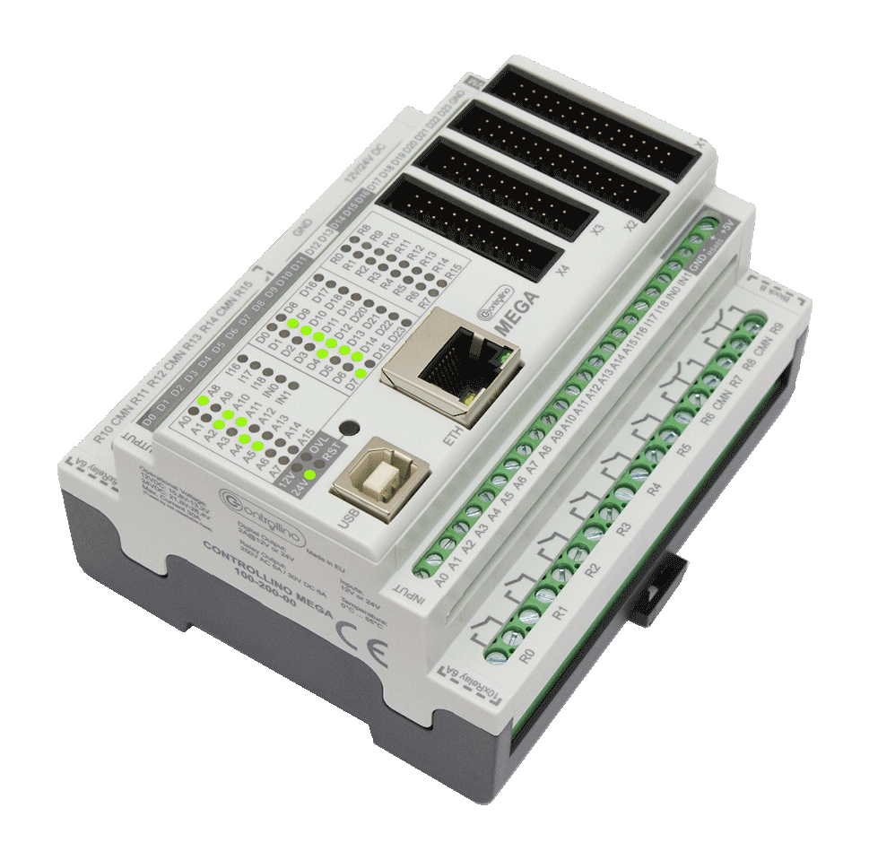
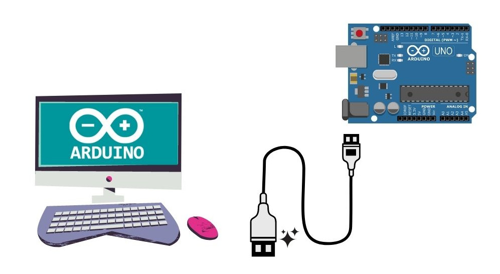
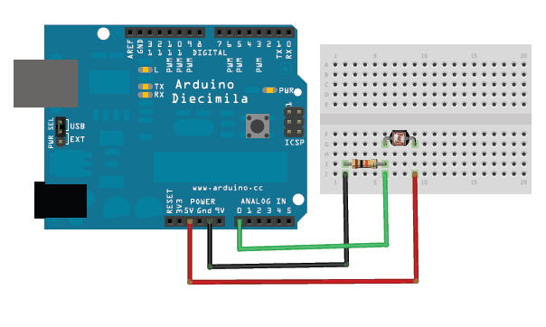

## Basics of Embedded and IoT Development with Python 
We gonna have some brush up on how you can get started 
using Python to build IoT Applications, as we have discussed on the intro session about 
python taking a leap intro Embedded and IoT Dev, let's now dive little deeper to see how
you can get started with it as a Python Beginner.  


## Embedded Dev with Python 

Here we will see how to control Embedded Devices using Python through variety techniques,
There are some few choice of micro-controllers Development that run python natively themselves
such as [Raspberry Pi](https://www.raspberrypi.org/) and [Pyboard](https://store.micropython.org/) with many others choice in which we can control with Python using 
certain protocols, examples of this board includes [Arduino Uno](https://www.arduino.cc/) and [ESP8266](https://www.esp8266.com/).


Due availability In a this Pycon workshop, we are going to focus more on controlling Arduino compatible Arduino boards
We are going to see different approaches that are being used on controlling this micro-controller board Tfrom Python.



If this is your first time hearing about Arduino boards, well its a programmable prototyping board that is heavily used by different kinds of people 
from proffessionals, teachers , students , hobbyst and ... to learn and build micro-controller based electronics projects in easy and simple way.

It has a huge community support with tons of libraries published, and its now being used by different starttup to build their MVP electronics projects
Therefore knowing how deal and control it might open countless of other opportunites.

Apart from the fact arduino is used as Prototyping board, its now being employed to industrial grade to controll industrial process,
with Development of improved board such as [Controllino](https://www.controllino.com/) simplify the whole process when it comes to industrial Automation and Control using builtin arduino board
being programmed by the same arduino IDE.



## Can Arduino run Python ?

Python cannot run or be excuted directly on the arduino-micro-controller from the fact that in order to run python on it,  we need some kind of 
interpreter running in micro-controller which will be memory expensive. some arduino board comes with about **14KiB flash of memory** which can 
be un realist running both an interpreter together with source code in that range of memory.

## How do we control Arduino Python ?

Arduino board can be controlled with Python over USB through Serial communication in combination with some protocols, The following are 
some of approaches that are being done to accomplish this.



- [PySerial](https://pypi.org/project/pyserial/)
- [PyFirmata](https://pypi.org/project/pyFirmata/)
- [Arduino-python3](https://pypi.org/project/arduino-python3/)

### PySerial with Arduino

### Installation 

```bash
$ pip install pyserial
```

**PySerial** is a python library that enables the access and control of **Serial port** from Python, with libary 
we can directly read the data sent from arduino board over USB and also write to it. 

In order to control a board using PySerial, we need tell python a **specific port** we are gonna be reading and writing to, 
this can be done in easy syntax just as shown below.

Using PySerial you might need to get familiar with both python and arduino language, whereby you're going to use arduino language to 
read signals from 

```c++


int led = 13;

void setup(){
    pinMode(led, OUTPUT);
    Serial.begin(9600);
}

void loop(){
  if (Serial.available()){
      char command = Serial.read();
      if (command=='o'){
        digitalWrite(led, HIGH);
      }
      else{
        digitalWrite(led, LOW);
      }
  }
}

```
The above arduino code is written in such a way it will be waiting for a signal through Serial port to control the builtin light 
emitting diode, the Python code to blind the LED would normally look like this.

```python
import time  
from serial import Serial

arduino_board = Serial('/dev/ttyUSB0', baudrate=9600, timeout=1)

def blink():
  while True:
    arduino.write(b'o')
    time.sleep(1)
    arduino.write(b'f')
    time.sleep(1)

blink()
```

The above example how to write/control arduino elements from python, you can also read the signal from sensors connected to the arduino 
board using the similar technique, for instance let's try reading a light intensity of and LDR connected to the arduino pin A0;




The arduino-code would look like this 
```c++
int ldr = A0;

void setup(){
  pinMode(ldr, INPUT);
  Serial.begin(115200);
}

void loop(){
  int intensity = analogRead(ldr);
  if (Serial.available()){
    char command = Serial.read();
    if (command=='r') Serial.println(intensity);
  } 
}

```

The above arduino will return the state of light intensity to an arduino when it recieve a **r** command 
other wise it will do nothing.

On the other side the Python code to read the sensor signal sent by arduino is going to look like this 

```python
from serial import Serial

arduino = Serial('/dev/ttyUSB1', baudrate=115200, timeout=1)
arduino.flush

while True:
    arduino.write(b'r')
    light_intensity = arduino.readline().decode()
    print(light_intensity)
```

## When to use PySerial ?
I recommend to use PySerial when something you want to control is bit complex and required other arduino libraries to run,
therefore writting a code in native arduino language and providing an interface to python using Serial communication would be 
better approach since the other mentioned approaches use standard **firmata protocols** which only provide basic control to the arduino,
incase you wanna something complex you might wanna reinvent the wheel and design the libraries from scratch which is not advised.

If you want a detailed description to PySerial with arduino, I recommend you checking out this repo [ArduinoPySerial_Series](https://github.com/Kalebu/ArduinoPySerial_LearningSeries)

### PyFirmata with Arduino

#### Installation

```bash
$ pip install pyFirmata
```

**PyFirmata** is a python libary that alllow python to communicate with arduino over USB using standard firmata protocol, 
[standard firmata](https://www.arduino.cc/en/reference/firmata), to get started you just need to upload the standard firmata code to 
the arduino board.

Here is link to [standard-firmata-code](https://github.com/Kalebu/Python-for-Embedded-and-IoT/blob/main/basics/pyfirmata-with-arduino/standard_firmata.ino)

Once you upload the code to the arduino board you're now ready to get started controlling it using pyfirmata library just as shown below

Here is python-code to blink the LED

```python
import time
from pyfirmata import Arduino

board = Arduino('/dev/ttyUSB0')

def blink():
  while True:
    board.digital[13].write(1)
    time.sleep(1)
    board.digital[13].write(0)
    time.sleep(1)

blink()
```

The above code will be intepreted in real-time by the firmata protocol running on arduino board and use it to peform corresponding action, 
for instnce for now it's going to blink the LED.

Here is a python-code to read an LDR with firmata protocols

```python
import time 
from pyfirmata import Arduino, util

board = Arduino('/dev/ttyUSB0')

util.Iterator(board).start()
board.analog[0].enable_reporting()

while True:
  light_intensity = board.analog[0].read()
  print(light_intensity)
  time.sleep(1) 
```

For more information on PyFirmata you can visit their official [PyFirmata Documentation](https://pyfirmata.readthedocs.io/en/latest/)

### Arduino-python3

#### Installation

```bash
$ pip install arduino-python3
```

**Arduino-python3** A light-weight Python library that provides a serial bridge for communicating with Arduino microcontroller boards, 
It is written using a custom protocol, similar to Firmata.

To get started using Arduino command API in python you might need to firtly upload the prototype protocol code to the arduino and then 
you're on the move to begin using python to control it.

Here is a link to [Arduino-commnad-api-protocol](https://github.com/Kalebu/Python-for-Embedded-and-IoT/blob/main/basics/arduino-python3/prototype/prototype.ino)

Blinking an LED with Arduino command API would normally look like this 

```python
import time
from Arduino import Arduino

board = Arduino()
board.pinMode(13, "OUTPUT")

while True:
    board.digitalWrite(13, "HIGH")
    time.sleep(1)
    board.digitalWrite(13, "LOW")
    time.sleep(1)
```
The above code will automatically find the port an arduino is connected and connect to it and then begin controlling 
the arduino using its own custom protocol similar to that of firmata.

Here is the arduino code to read signal from LDR using custom protocol

```python 
import time
from Arduino import Arduino

board = Arduino()

while True:
    light_intensity = board.analogRead(0)
    print(light_intensity)
    time.sleep(0.1)
```

Arduino-command-API can be one with the easiest syntax of all the alternative so it all comes to you which one you choose to build 
your Embedded solution, for more info visit their [github repository](https://github.com/Kalebu/Arduino-Python3-Command-API)

## IOT Dev with Python 

Here we will see how to link our Embedded Devices to Cloud with Python, there are several options 
you could use to bring your Embedded Devices to cloud using Python, one of them is using python web framework
such as [Django](https://www.djangoproject.com/), [Flask](https://flask.palletsprojects.com/en/1.1.x/) and [FastApi](https://fastapi.tiangolo.com/). 

In our today workshop we are going to use **Flask** to connect our devices to the internet.

### Installation

```python
$ pip install flask 
```

If you're new to Flask, well it very straight forward micro-web framework, you can still understand it 
even if you don't have a previous experience with it.

A very simple Flask Gateway might look like this

```python
from flask import Flask
app = Flask(__name__)

@app.route('/')
def Gateway():
  return {
    'who_am_i': 'I\'m a very simple IoT Gateway'
  }

if __name__ == '__main__':
  app.run(debug=True)
```

Above is our simple web-server made with flask, once you run you should see result to what shown below 

```bash
kalebu@kalebu-PC IoT -> python3 hello_world.py 
 * Serving Flask app "hello_world" (lazy loading)
 * Environment: production
   WARNING: This is a development server. Do not use it in a production deployment.
   Use a production WSGI server instead.
 * Debug mode: on
 * Running on http://127.0.0.1:5000/ (Press CTRL+C to quit)
 * Restarting with inotify reloader
 * Debugger is active!
 * Debugger PIN: 133-374-948
```

Now that we have seen how a Simple flask work now leds make a simple control, that allows us to controll the light emitting diode from browser 

Now we know how flask work let's make a simple program which gonna allow us to easily control the light emitting diode from web, 
in this example I have used arduino command api but infact you could use any of your favorite library.

with arduino command api our Gateway code is going to look like  this 

```python 
from flask import Flask
from Arduino import Arduino

board = Arduino()
app = Flask(__name__)

board.pinMode(13, "OUTPUT")

@app.route('/<command>')
def Gateway(command):
    if str(command) == 'on':
        board.digitalWrite(13, "HIGH")
        response = "The led is on"
    elif str(command) == 'off':
        board.digitalWrite(13, "LOW")
        response = "The led is off"
    else:
        response = 'Uknown command'
    return {'response': response}

if __name__ == '__main__':
  app.run(debug=True)
```

## Demo project
We can even something more interesting with it, the limit is your own imagination, now lets make a simple python which 
we can ask it how it's outside using voice and then reply back to us.

In this example I have used Speech Recognition library but you don't need to know all of it just made a wrapper you can just call a listen 
function and then it will will do the rest. ghost package is found in the IoT folder you can just copy and make sure its in your project directory
or if you cloned the repo the folder and source code will be automatically downloaded.

Here is our code to act as minimal assistance over voice 

```python 
from Arduino import Arduino
from ghost import ghost_ear

board = Arduino()

def check_outside():
    for _ in range(1000):
        intensity = board.analogRead(0)
    intensity = board.analogRead(0)
    return intensity


def Eve_Soul():
    while True:
        print(board.analogRead(0))
        something = ghost_ear.listen()
        if something:
            outside_combo = ['outside', 'light', 'how', 'is outside', 'how is']
            if any(word for word in something.split() if word in outside_combo):
                outside = check_outside()
                print('outside intensity ', outside)
                if outside > 0:
                    print('It\'s not that dark')
                    board.digitalWrite(13, 'LOW')
                    continue
                print('Outside is dark, I\'m switching light on')
                board.digitalWrite(13, "HIGH")
                continue
            print('It\'s great serving you what can I help?')
            
if __name__ == "__main__":
    Eve_Soul()
```
